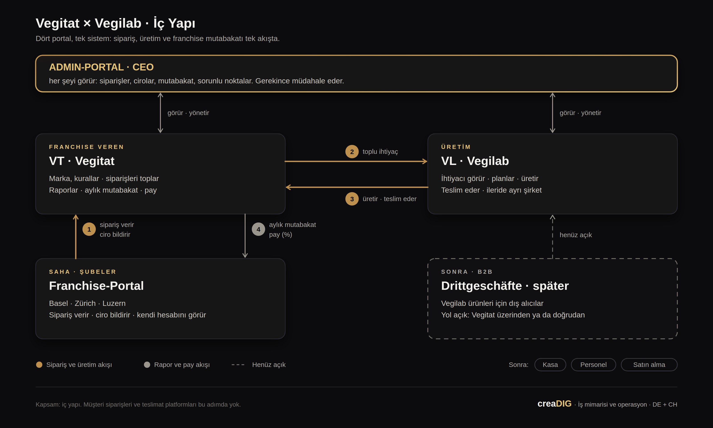

# Vegitat × Vegilab — Proje sunumu „İç Yapı“ (Türkçe fassung der Folien)

Folien: https://claude.ai/artifact/Cf3bqzKq33KS8QyTdopMZm · Grafik: `architektur-tr.svg` / `architektur-tr.png` · Systemnamen bleiben deutsch (Admin-Portal, VT · Vegitat, VL · Vegilab, Franchise-Portal, Drittgeschäfte · später).

## 1 · Başlık
**Vegitat × Vegilab** — Sipariş, üretim ve franchise'ı birbirine bağlayan bir iç yapı.
Alt satır: creaDIG · Emin Akyol · İş mimarisi ve operasyon · DE + CH

## 2 · Bugün her şey WhatsApp üzerinden yürüyor.
- **Sipariş** — Basel, Zürich ve Luzern siparişlerini Vegilab'a WhatsApp'tan veriyor. Sipariş durumu yok, geçmiş yok, planlama yok.
- **Franchise** — Cirolar ve paylar elle hesaplanıyor. Tek tuşla aylık rapor yok, iki taraf için de şeffaf bir görünüm yok.
- **Şirket** — Vegilab yalnızca Vegitat için üretiyor ve Vegitat'ın altında çalışıyor. Kendi yapısı olmadan üçüncü işletmelere satış yönetilemez.

**Bütün resim tek yerde değil. Sormadan görünmüyor.**

## 3 · Mimari: dört portal, tek sistem.

Akış: **1** şube sipariş verir ve ciro bildirir → **2** Vegitat toplar, Vegilab toplu ihtiyacı görür → **3** Vegilab üretir ve teslim eder → **4** ay sonunda mutabakat ve pay otomatik. Altın çizgi = sipariş ve üretim, gri = rapor ve pay, kesik = henüz açık.
- **Admin-Portal · CEO** — her şeyi görür: siparişler, cirolar, mutabakat, sorunlu noktalar. Gerekince müdahale eder.
- **VT · Vegitat** — Franchise veren · marka, kurallar · siparişleri toplar · raporlar · aylık mutabakat · pay
- **VL · Vegilab** — Üretim, ileride ayrı şirket · ihtiyaç · planlama · teslimat
- **Franchise-Portal** — Basel · Zürich · Luzern · sipariş verir · ciroyu bildirir · kendi hesabını görür
- **Drittgeschäfte · später** — Vegilab için B2B alıcılar. Yol henüz açık: Vegitat üzerinden ya da doğrudan.

Alt satır: Sonra: Kasa · Personel · Satın alma. Kapsam iç yapı; müşteri siparişleri ve teslimat platformları bu adımda yok.

## 4 · Ne kazanılır: kontrol, düzen, büyüme.
- **Yönetim** — Bütün resim tek ekranda: sipariş, ciro, hesap, üretim. Kararlar sorarak değil, bakarak verilir. Bilgi kişilerde değil, sistemde durur.
- **Franchise** — Sipariş telefondan, dakikalar içinde. Kendi cirosunu ve payını görür, tartışma biter. Yeni şube ilk gün portalla açılır.
- **Vegilab** — Tahminle değil, gerçek ihtiyaçla üretir. Kendi yapısıyla ileride Drittgeschäfte'ye de satabilir.

**Her yeni şube WhatsApp'la açılırsa karmaşa büyür. Portalla açılırsa düzen ilk günden gelir.**

## 5 · Üç adım: önce görünür kıl, sonra yönet.
1. **Yapı analizi · yaklaşık 2 hafta** — Yerinde, tüm taraflarla: kim, neyi, ne zaman, kimden sipariş ediyor. Sonuç: üzerinde anlaşılmış mimari, sonraki her şeyin temeli.
2. **Dijital sipariş · yaklaşık 4 ila 6 hafta** — Franchise-Portal siparişi Vegitat'a verir, Vegilab toplu ihtiyacı görür. WhatsApp devreden çıkar, ilk rakamlar akmaya başlar.
3. **Mutabakat ve Admin · yaklaşık 6 ila 8 hafta** — Şube başına ciro, yüzde pay, aylık rapor otomatik. Yönetim her şeyi kendi portalında görür ve müdahale eder.

Çekirdek yaklaşık 3 ila 4 ayda çalışır, süreler yapı analizinden sonra kesinleşir. Sonrası: Drittgeschäfte, kasa, personel, satın alma. Müşteri siparişleri ve teslimat platformları bu adımda yok, ileride bağlanabilir.

## 6 · Kurmak, işletmek, geliştirmek. Sonraki adım.
**Böyle bir sistem kurulup bırakılmaz. Yaşar, bakım ister, gelişir. Bunun için içeride bir sorumlu gerekir; bu sorumluluğu üstlenmeye hazırım.**
- **İçeride bir sorumlu** — Yapı ve dijital satış tek elde, şirket içinde, uzun vadeli. Şekli birlikte belirleriz.
- **Adım adım, görünür** — Her adımın sonunda çalışan bir parça, her ay bir rapor. Ne kurulduğu, ne kaldığı hep görünür.
- **Sonraki adım** — Yapı analizine evet. Başlangıç önümüzdeki iki hafta içinde, yerinde. Senden gereken: iki üç gün, ekibe ve sipariş geçmişine erişim, franchise kuralı.

**Sistem ve veriler Vegitat'ın. Her adımın sonunda durabilirsin, kurulan sende kalır.**

Sözlü, sorarsa: „Bunu parça başı iş olarak değil, içeride kalıcı bir sorumluluk olarak görüyorum." Ortaklık slaytta yok; konu açılırsa açık, birlikte konuşulur.
