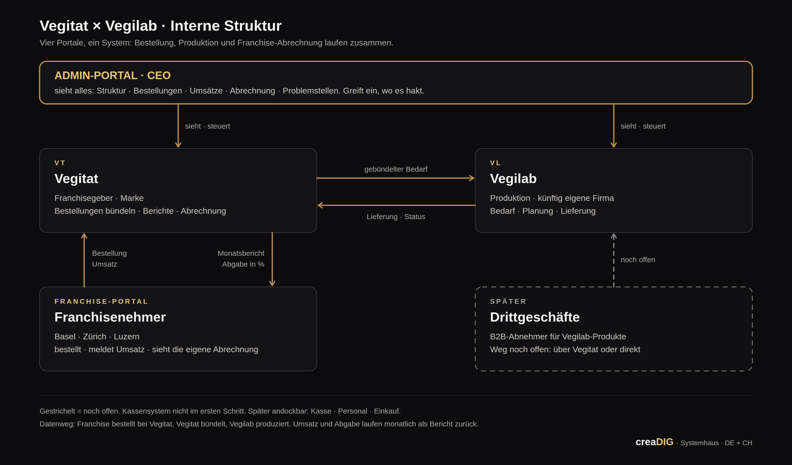

# Vegitat × Vegilab — Projektvorstellung „Interne Struktur“

**Stand:** 2026-09-22 · Termin mit Mutalip Karahan (Gründer, Vegitat GmbH, Basel)
**Folien:** 5 Folien, Deutsch mit je einer türkischen Zeile, Sprechernotizen auf Türkisch → https://claude.ai/artifact/Cf3bqzKq33KS8QyTdopMZm
**Architektur-Grafik:** `architektur.svg` (Vektor) · `architektur.png` (fürs Handy / WhatsApp)

## Leitplanken aus dem Briefing

- **Interne** Struktur, nicht Internet: Diese Architektur gibt es heute nicht.
- Alle Standorte (Basel, Zürich, Luzern) sind **Franchisenehmer**. Bestellungen an Vegilab laufen heute per **WhatsApp**.
- **Vegilab** produziert nur für Vegitat und läuft unter Vegitat. Soll eigene Firma werden. Die Gründung ist **nicht** Teil des Angebots, nur Struktur und Prozess.
- **Drittgeschäfte:** später. Weg offen: über Vegitat (wie Franchise) oder direkt an Vegilab.
- **Kassensystem:** nicht im ersten Schritt, spätere Option (CASSAMEA). Werte für die Abrechnung zuerst per Eingabe im Portal, später aus der Kasse.
- **Catering:** wird nicht erwähnt.
- **Rolle:** feste Rolle in der Firma, langfristig. Beteiligung offen. Kein „mach das, gib mir das“. **Keine Zahl im Termin.**
- **Sprache:** Gespräch Türkisch, Folien Deutsch.

## Folie 1 · Titel

**Vegitat × Vegilab** — Eine interne Struktur, die Bestellung, Produktion und Franchise verbindet.
TR: *Sipariş, üretim ve franchise: tek bir iç sistemde.*
Fuß: creaDIG · Emin Akyol · Systemhaus · DE + CH

## Folie 2 · Heute läuft alles über WhatsApp.

TR: *Bugün sipariş, hesap ve plan WhatsApp'tan yürüyor.*

| Bestellung | Franchise | Firma |
|---|---|---|
| Basel, Zürich und Luzern bestellen per WhatsApp bei Vegilab. Kein Bestellstand, keine Historie, keine Planung. | Umsätze und Abgaben werden von Hand abgerechnet. Kein Monatsbericht auf Knopfdruck, keine offene Sicht für beide Seiten. | Vegilab produziert nur für Vegitat und läuft unter Vegitat. Ohne eigene Struktur kein Drittgeschäft. |

**Der CEO sieht das Ganze nur, wenn er nachfragt.**

## Folie 3 · Die Architektur: vier Portale, ein System.

TR: *Dört portal, tek sistem: Admin görür, Vegitat yönetir, Vegilab üretir, franchise sipariş verir.*

- **Admin-Portal · CEO** — sieht alles: Struktur, Bestellungen, Umsätze, Abrechnung, Problemstellen. Greift ein, wo es hakt.
- **VT · Vegitat** — Franchisegeber · Marke · Bestellungen bündeln · Berichte · Abrechnung
- **VL · Vegilab** — Produktion, künftig eigene Firma · Bedarf · Planung · Lieferung
- **Franchise-Portal** — Basel · Zürich · Luzern · bestellt · meldet Umsatz · sieht die eigene Abrechnung
- **Drittgeschäfte · später** — B2B-Abnehmer für Vegilab. Weg noch offen: über Vegitat oder direkt.

Datenweg: Franchise bestellt bei Vegitat → Vegitat bündelt → Vegilab produziert. Lieferung und Status zurück. Monatsbericht und Abgabe in % zurück ans Franchise. Gestrichelt = noch offen. Kassensystem nicht im ersten Schritt; später andockbar: Kasse, Personal, Einkauf.

## Folie 4 · Drei Schritte: erst sichtbar machen, dann steuern.

TR: *Önce görünür kıl, sonra yönet.*

1. **Strukturaufnahme** — Vor Ort mit allen Beteiligten: wer bestellt was, wann, bei wem. Ergebnis: die abgestimmte Architektur als Grundlage für alles Weitere.
2. **Bestellung digital** — Das Franchise-Portal bestellt bei Vegitat, Vegilab sieht den gebündelten Bedarf. WhatsApp wird abgelöst, die ersten Zahlen laufen ein.
3. **Abrechnung und Admin** — Umsatz je Filiale, Abgabe in Prozent, Monatsbericht automatisch. Der CEO sieht alles in seinem Portal und greift ein.

Danach, wenn der Kern läuft: Drittgeschäfte, Kasse, Personal, Einkauf.

## Folie 5 · Bauen und betreiben. Meine Rolle.

TR: *Kurup gitmiyorum. Kurup işletiyorum.*

**Ich baue dieses System nicht ab und gehe. Ich baue es, betreibe es und bleibe dafür verantwortlich.**

- **Feste Rolle** — Verantwortlich für Struktur und digitalen Vertrieb, in der Firma, auf Dauer. Beteiligung: offen, gemeinsam zu klären.
- **Kein Projekt nach Stunden** — Kein „mach das, gib mir das“. Ein System, das gepflegt, nachverfolgt und weiterentwickelt wird.
- **Nächster Schritt** — Ja zur Strukturaufnahme. Termin vor Ort, danach die finale Architektur und das Modell der Zusammenarbeit.

Hinter mir: creaDIG als Systemhaus mit eigenen Systemen im Betrieb, darunter ein Kassensystem für die Gastronomie in der Schweiz.

## Gesprächsleitfaden (Türkisch führen, Folien zeigen)

**Ziel des Termins:** sein Ja zur Strukturaufnahme vor Ort. Nicht mehr.

**Fragen an ihn:**
1. Wie viele Bestellungen pro Woche kommen heute per WhatsApp bei Vegilab an, und wer nimmt sie an?
2. Wie wird die Franchise-Abgabe heute berechnet, und wann fließt sie?
3. Was willst du jeden Morgen als Erstes sehen?
4. Wer soll außer dir ins System schauen dürfen?
5. Wann können wir die Strukturaufnahme vor Ort machen?

**Einwände, die kommen werden:**
- „Was kostet das?“ → Modell erklären (feste Rolle, kein Stundenprojekt). Zahl nach der Strukturaufnahme.
- „Mit WhatsApp läuft es doch.“ → Historie, Planung, Abrechnung. Was passiert, wenn eine Person ausfällt?
- „Warum du?“ → Bauen und betreiben, Systemhaus, Kassensystem CH. Dein Bruder kennt die Abläufe von innen.
- Frühere Zusammenarbeit → kurz und offen ansprechen, dann nach vorn.
